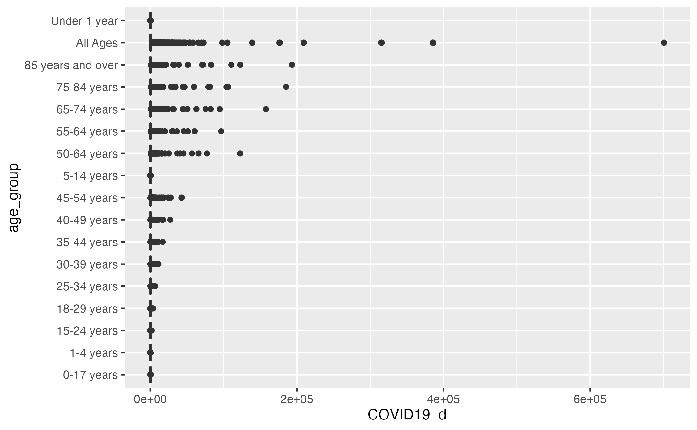
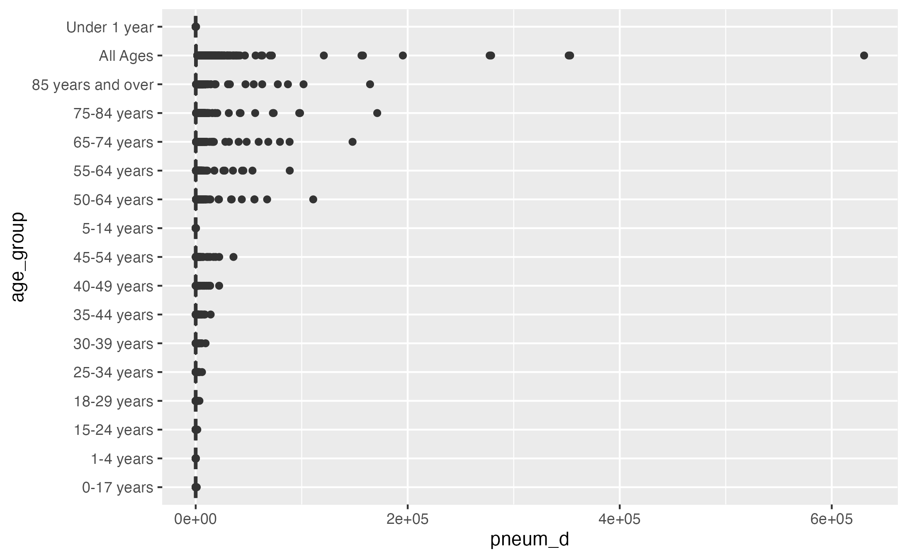
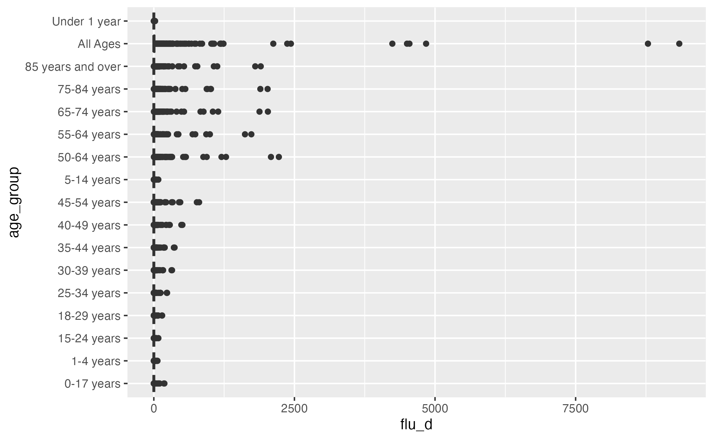
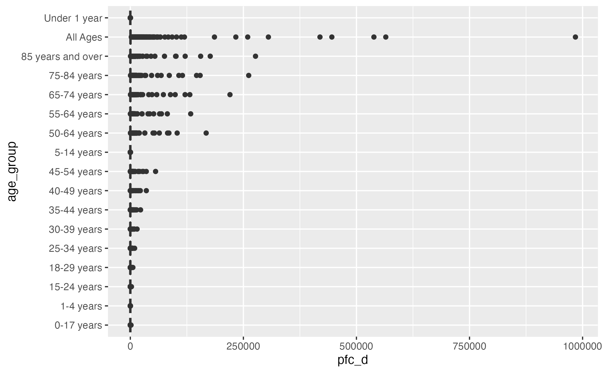
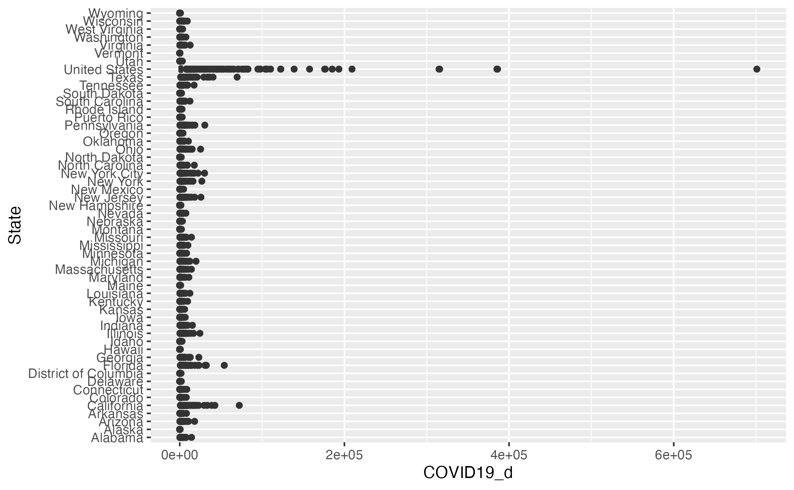
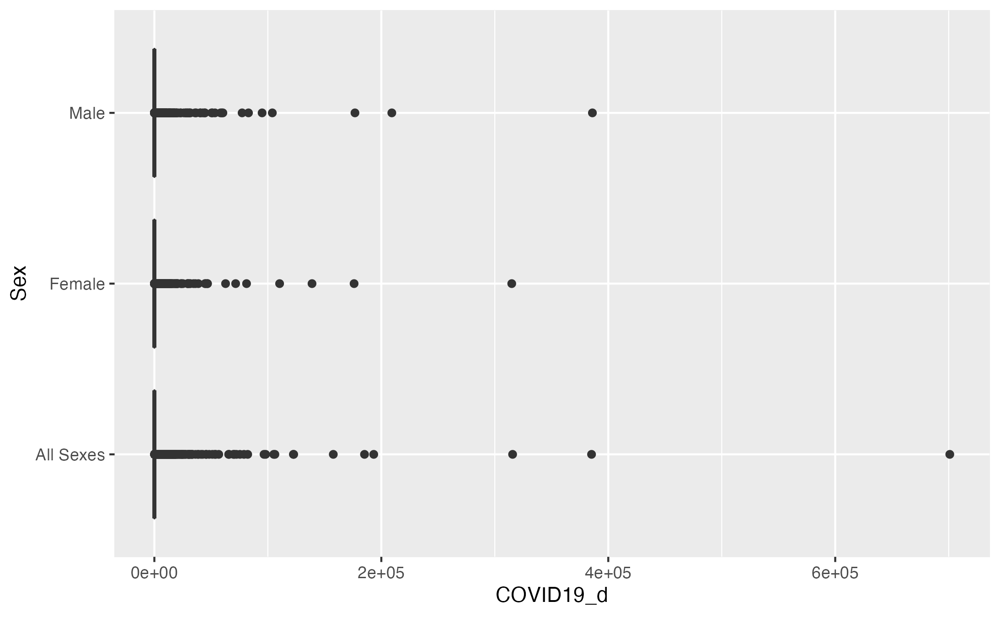

# Summary/Abstract
The current outbreak of COVID-19 severe respiratory disease, which started in Wuhan, China, is an ongoing challenge, and a major threat to public health that requires surveillance, prompt diagnosis, and research efforts to understand this emergent pathogen and to develop an effective response. This study was looking for a model that can help with the prediction about death for COVID-19 and Pneumonia based on age, sex. Using a multiple linear regression model with (R^2 = 0.84) after the BOX_COX correction, the model can be considered a good predictor.  


# Introduction 

It is well known that we are currently immersed in the pandemic attributed to the Covid 19 virus, which has generated great repercussions mainly in health, as it has involved the death of millions of people and has left hundreds more delicate and vulnerable to other types of diseases; it is also important to mention that this virus has not only affected the health of individuals, but has also led to a decline in the world economy, in tourism, in the physical condition and has seen a large increase in the unemployment rate. In this sense, being at the height of the virus, it is important to study the related deaths it has caused, as well as to identify the possible or not relationship that the virus has with other pathologies such as pneumonia and influenza.

## General Background Information

Influenza and pneumonia caused around 14.9 deaths in the U.S. per 100,000 population in 2018. Influenza and pneumonia are among the leading causes of death in the United States, accounting for around 1.7 percent of all deaths in 2019. Influenza, or the flu, is a viral infection that is highly contagious and especially common in the winter season. Influenza is a common cause of pneumonia, although most cases of the flu do not develop into pneumonia. Pneumonia is an infection or inflammation of the lungs and is particularly deadly among young children and the elderly. However, the recent COVID-19 pandemic is leading the causes of death due to respiratory infection diseases, due to its severity. In U.S, 768,204 deaths were attributed to COVID-19 on death certificates [https://www.cdc.gov/nchs/covid19/mortality-overview.htm]

As all of three diseases, COVID-19, Influenza, and Pneumonia are contagious respiratory illness; establish a relationship between those three disease could be beneficial for medical community. However, the main objective of this study is analyze the relationship between deaths for COVID-19 and Pneumonia and the demographics variables such as, age, state and sex.

## Description of data and data source

The data set that will be used is Provisional COVID-19 Deaths by Sex and Age (CDC data updated October 6, 2021). The dataset shows the deaths involving coronavirus disease 2019 (COVID-19), pneumonia, and influenza reported to NCHS by sex, age group, and jurisdiction of occurrence.

The study variables are classified as follows:
- Variable: Start date/Type: Quantitative-continuous/Scale:Interval
- Variable: End date/Type:Quantitative-continuous /Scale:Interval
- Variable: Group/Type:Categorical/Scale:Nominal/Information: Mode in which the record is grouped. Generally, it is manifested according to the month or year.  
- Variable: Year/Type: Quantitative-discrete/Scale:Ratio/ Information: Year to which the record is associate.
- Variable: Month /Type: Categorical/Scale: Nominal/Information: Month to which the record is associate.
- Variable: State/Type: Categorical/Scale: Nominal/ Information: State of the United States to which the record refers.
- Variable: Age Group/ Type: Categorical/Scale: Nominal/ Information: At this point it is important to clarify that the age variable in its nature is quantitative-continuous measured on a ratio scale; however, since a grouping was made, it would be taken as qualitative.
- Variable: COVIS-19 deaths / Type: Quantitative-discrete/ Scale:Ratio/ Information: It refers to the deaths that occurred due to covid-19 infection.
- Variable: Total deaths/ Type: Quantitative-discrete/ Scale:Ratio/ Information: This is the total number of deaths that occurred at a given time for a particular state.
- Variable: Pneumonia deaths/ Type:Quantitative-discrete/ Scale:Ratio/ Information: It refers to the deaths that occurred due to pneumonia infection.
- Variable: Pneumonia and covid-19 deaths/ Type:Quantitative-discrete/ Scale:Ratio/ Information: It refers to the deaths that occurred due to pneumonia infection but also due to the covid-19 virus.
- Variable: Influenza deaths/Type:Quantitative-discrete/ Scale:Ratio/ Information: It refers to deaths due to influenza infection.
- Variable:Pneumonia, influenza, or covid-19 deaths//Type:Quantitative-discrete/ Scale:Ratio/Information: It refers to deaths due to influenza infection, pneumonia or covid-19. It may have been due to one or more of them.

## Questions/Hypotheses to be addressed

Are the death for COVID-19 and Pneumonia can be predicted based on age, state, and sex of the patient?

# Methods and Results
The raw data shows a significant amount of missing values, that could be attribute to the age groups, and also the fact that every state has a the first COVID-19 death at different times during 2020. Due to the nature of the data set a multilinear regression model was performed, to predict death for COVID-19 and Pneumonia base on group age, state, and sex.

## Data import and cleaning
An exploratory analysis was performed:
Using the function skim a summary table from rawdata was obtained. The amount of missing values generated questions about the behavior of the data, plots and tables were developed to understand the data. At the end of the exploratory analysis a new data set was created. I t eas named dt1 and contains 851 observations of 14 variables.

- Summary table (Rawdata)
```{r summarytable,  echo=FALSE}
tableRawData=readRDS("../../products/graphs/tableRawData.rds")
knitr::kable(tableRawData, caption = 'Data summary table.')
```
-Plot1 : x= COVID19_d VS y=age_group

```{r resultfigure,  fig.cap='Analysis figure.', echo=FALSE}

```
-Plot2 : x= pneum_d, y=age_group

```{r resultfigure,  fig.cap='Analysis figure.', echo=FALSE}

```
-Plot3 : x= flu_d, y=age_group

```{r resultfigure,  fig.cap='Analysis figure.', echo=FALSE}

```
-Plot4 : x= pfc_d, y=age_group

```{r resultfigure,  fig.cap='Analysis figure.', echo=FALSE}

```
-Plot5 : x= COVID19_d, y=State

```{r resultfigure,  fig.cap='Analysis figure.', echo=FALSE}

```
-Plot6 : x= COVID19_d, y=Sex

```{r resultfigure,  fig.cap='Analysis figure.', echo=FALSE}

```

## Full analysis
Outcome Variable: Pneumonia and COVID-19 death (pc_d)
Independent Variables: age_group, Sex, State

Having in consideration the nature of the variables a multiple linear regression model was performed. The R^2=0.75 was obtained from the model. Although the model presented a good coeffiente of relation (R^2) there were some issues associate with the assumptions. A Box-Cox transformation was performed. After performing the box-cox transformation, the model was ran again and an improvement in the coefficient of determination (R^2 = 0.84) is observed and at the same time, graphically and analytically, it can be said that the assumptions of the model are being fulfilled (except for the autocorrelation assumption, but this could possibly be due to the nature of the data or the data collection). The assumptions were validated through tests such as shapiro wilks for normality, reset for linearity (although it is not very common to evaluate this assumption through an analytical test), Breusch-Pagan for the homogeneity of variance assumption and Durbin-Watson for the autocorrelation assumption.   

An ANOVA was performed, with α=0.05 we can reject the null hypothesis about independent variables are all the same. 
```{r ANOVA,  echo=FALSE}
table_Anova=readRDS("../../products/graphs/table_Anova.rds")
knitr::kable(table_Anova, caption = 'ANOVA.')
```
Since the main question is about a prediction Pneumonia and COVID-19 deaths based on independent variables associates with the individuals, a decision tree model was performed, considering that this is a predictor model. The independent variables considering were age_group and Sex. 

## Strengths and Limitations
-The amount of missing values results in a significant reduction of the data set, it could be reflected in the outcomes (R^2).
-In this study the presence of comorbidities, such as cardiac disease, diabetes, high blood pressure, etc was no considered, however, performed a study including several comorbidities could be beneficial, to improved the predictions about COVID-19 deaths.

## Conclusions
Mortality due to COVID-19 an Pneumonia are conditioning to age and sex. Base on the desition tree we can conclude that male patients between 25 and 64 years old are more likely to die due to COVID-19 and Pneumonia.

# References
Borghesi A, Zigliani A, Masciullo R, Golemi S, Maculotti P, Farina D, Maroldi R. Radiographic severity index in COVID-19 pneumonia: relationship to age and sex in 783 Italian patients. Radiol Med. 2020 May;125(5):461-464. doi: 10.1007/s11547-020-01202-1. Epub 2020 May 1. PMID: 32358691; PMCID: PMC7194500.[https://pubmed.ncbi.nlm.nih.gov/32358691/]


